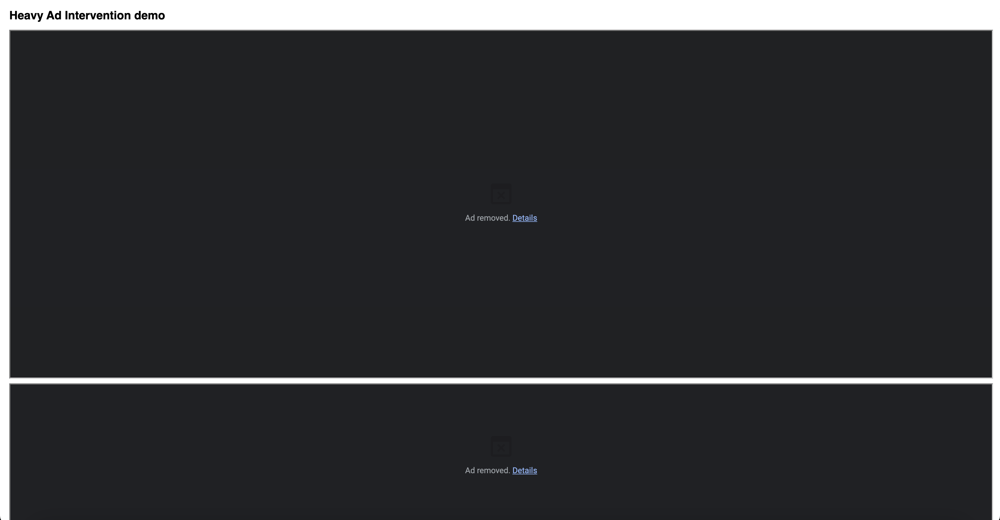

# Heavy-Ad Intervention Test Stand

Live demo: https://dimaturishchev.github.io/heavy.html  

This repo contains a minimal test page that forces Chrome’s Heavy-Ad
Intervention: one iframe exceeds the network limit, the other the CPU limit.

## Stable steps to reproduce

1. Host **heavy.html** somewhere or use the live demo above (if still online).  
2. Create a **new Chrome profile**.  
3. Navigate to **heavy.html** in that profile.  
4. The **network frame** is killed almost immediately.  
5. The **CPU frame** is killed in about 15 seconds in the current implementation  
   (12 July 2025, Chrome 138.0.7204.101).
